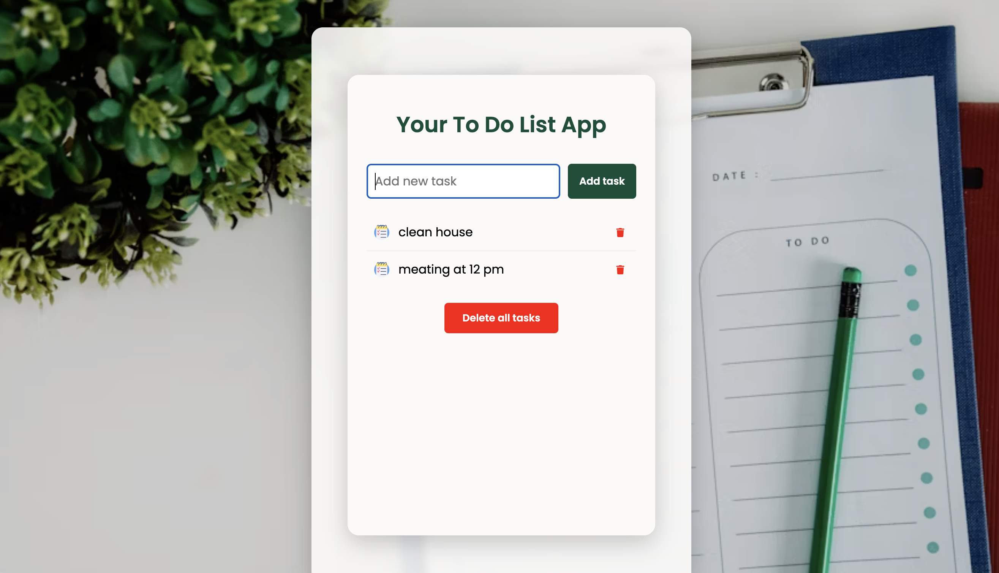

# 📝 Modern To-Do List App

A sleek, responsive To-Do List application built with **React** and **Vite**. This project features a modern Glassmorphism UI, mobile-first design, and automated deployment via GitHub Actions.

---

## 🚀 Live Demo
[**View the Live Application here**](https://nataliialitskevych.github.io/my-todo-app/)

## 📸 Preview
<p align="center">
  
</p>

---

## ✨ Features
* **Lightning Fast:** Powered by Vite for optimized development and build speed.
* **Modern UI:** Glassmorphism design with a beautiful background blur effect.
* **Responsive:** Fully adapted for mobile, tablet, and desktop screens.
* **Automated Deployment:** Integrated with **GitHub Actions** for seamless updates upon every push.
* **Task Management:** Add, complete (strikethrough), and delete tasks efficiently.

## 🛠️ Tech Stack
* **React 18** (Hooks & Functional Components)
* **Vite** (Next-generation frontend tool)
* **CSS3** (Flexbox, Backdrop-filters, Media Queries)
* **GitHub Actions** (CI/CD Pipeline)

---

## ⚙️ Installation & Setup

1. **Clone the repository:**
   ```bash
   git clone https://github.com/nataliialitskevych/my-todo-app.git

2. **Install dependencies:**
      npm install

3. **Run the app:**
      npm start

4. **Open the app in your browser:**
      👉 http://localhost:3000

---

## 🧠 Author

👩‍💻 **Nataliia Litskevych** 
